To understand the code, here are some scenarios showing what modules/functions are used.
In (link to fig), green shows the cowboy request process and blue shows the act_deny process

# 1. Sunny Day "Language" Example
In this example, the api for the "language" simulator is called. 
I.e. there is no preconfigured state in the simulator and the simulator just assesses whether this command
might work for some orchestrator/actuator.

## 1.1 Cowboy
ocas_app starts a cowboy webserver with ranch listeners.

routes are established within cowboy so that when 
http requests contain the following paths
then the following handlers are invoked:
- status    status_handler.erl
- ok        status_ok_handler.erl
- openc2    openc2_handler.erl

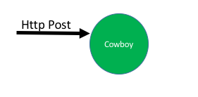

## 1.2 status_ok_handler.erl
status_ok_handler.erl is a simple routing that only excepts GET, 
ignores any parameters,
and returns "ok".
This is used as a keepalive so you know the simulator is accepting requests.


## 1.3 openc2_handler.erl

The sunny day path thru openc2_handler is documented in the following example.
For this example, it is assumed a POST to /openc2 was sent with valid JSON containg a valid "deny" action eg:

```erlang
{
"action": "deny",
"target": { 
          "type": "cybox:address",
          "specifiers": {
                        "cybox:address_object_type" : "ipv4-addr",
                        "address-value" : "192.168.22.33",
                        },
           },
"actuator": {
            "type": "network-firewall",
            "specifiers": "fw01"
            },
"modifiers": {
             "response": "ack",
             "where": "perimeter"
             }
}
```

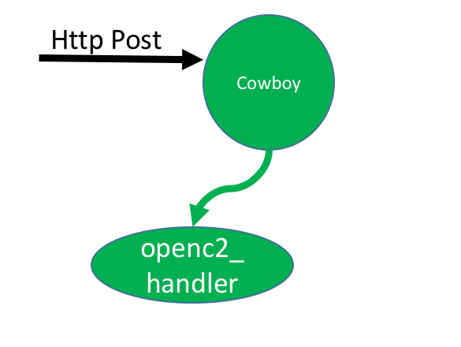

The flow is as follows:

1. cowboy calls openc2_handler:init/3 initializing the handler to use REST (and therefore rest_init/2 is called
2. cowboy calls openc2_handler:rest_init/2 just logs some info and sets the State variable to empty
3. cowboy calls openc2_handler:allowed_methods/2 which passes since since a POST was sent
4. cowboy calls openc2_handler:content_types_accepted/2 which passes control to openc2_handler:handle_json 
since the json header was sent
5. openc2_handler:handle_json/2 checks if the request contains a body (it does) and tail recurses to body_check/3 with the first parameter true
6. openc2_handler:body_check(true,...) checks if body is json (it is) and tail recurses to is_body_json/3 with the first parameter true
7. openc2_handler:is_body_json(true,...) decodes the JSON into erlang terms (and stores them in State) and then checks if action is in the JSON (it is) and tail recurses to has_action/3 with first parameter true
8. openc2_handler:has_action(true,...) gets some info to put in State and calls actions:spawn_action/3

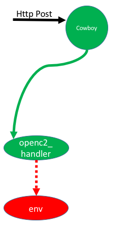

## 1.4 actions.erl
continuing the deny example above

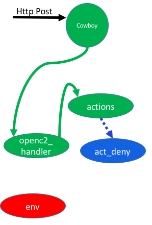

9. actions:spawn_action( <<"deny">>,  Req, State ) matches. 
In this "language" example (ie checking format, not a pre-initialized simulation of a particular configuration), the deny_server was not already running 
so it calls act_deny:start(State) to spawn the deny_server. 
Note act_deny.erl is in the action_servers directory. 
Spawn_action  then sends the newly spawned server a keepalive. It tail recurses to action_valid with Action=deny, the Pid returned from starting the allow server, the response from the keepalive (in this case {keepalive_received, deny_server}), and Req(for http housekeeping)
Note openc2_handler and actions are in the same cowboy process spawned for this http request.
act_deny is a separate process.
In (link to fig), green shows the cowboy request process and blue shows the act_deny process
10. action_valid(allow,...) stores some State (that it was a valid action, and action=deny) and tail recurses to verify_keepalive
11. verify_keepalive( {keepalive_received, deny_server} matches (because in this sunny day example the keepalive worked). verify_keepalive records keepalive true in State 
12. verify_keepalive tail recurses to targets:get_target

## 1.5 targets.erl

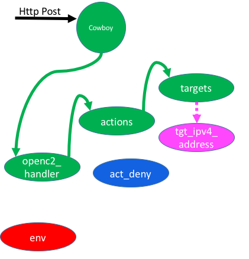

1.6.13. targets:get_target
1.6.14. more

## 1.6 actuators.erl

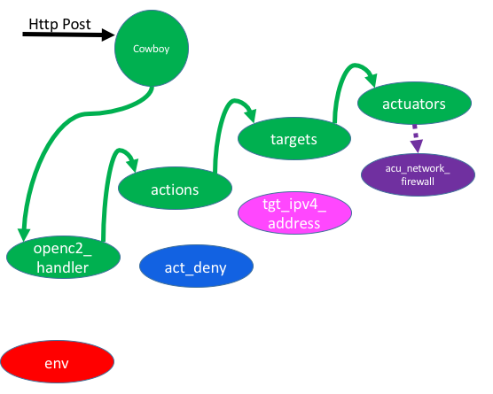


## 1.7 modifiers.erl

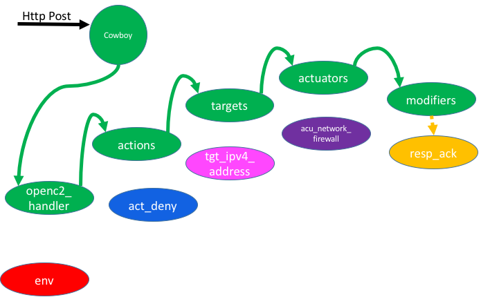


## 1.8 check.erl

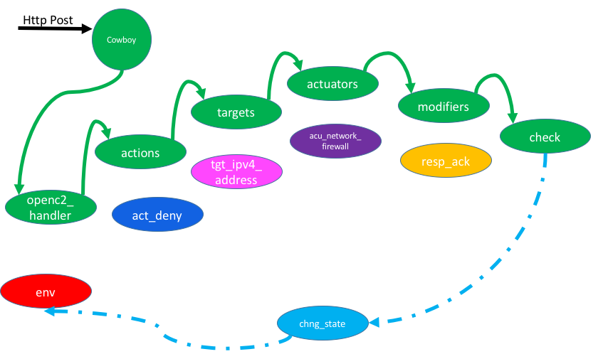

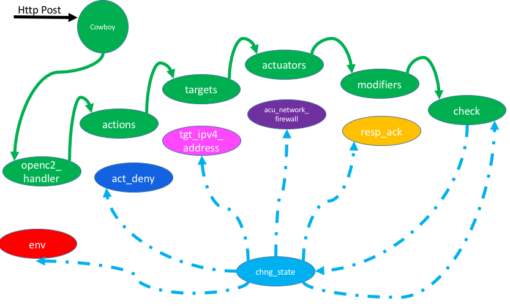

## 1.9 env.erl
Contains environmental info about the simulator. 
For example simulator_type:
* language
* enclave 
* actuator

simulator_type=language is context insensitive. 
It assumes a command is valid if there is any possible enclave/actuator 
where it might work (ie it doesn't check context based on previous state).

simulator_type=enclave simulates an orchestrator for an enclave. 
enclave_map contains the configuration data including valid_commands, actuator_map,
and any other info (eg protected ip's?). 
In this case, the actuator_map has all the actuators and the pids for all the actuator servers 
(each of which contains the state information from previous commands).

simulator_type=actuator simulates one particular actuator. 
actuator_map contains the configuration data including actuator_type, valid_commands, 
and any other info including state fro previous commands (eg what fw rules already commanded).

In the sunny day example, the simulator_type=language so env and the actuators do not contain
state information from previous commands. check does validate the action/target pair (ie deny/ipv4) is valid
for the actuator (network-firewall). It does this by first instantiating env server 
(since this is language and env server was not previously started), sending it a message query about this command,
and receiving a message back that command is ok.

## 1.10 chg_state.erl
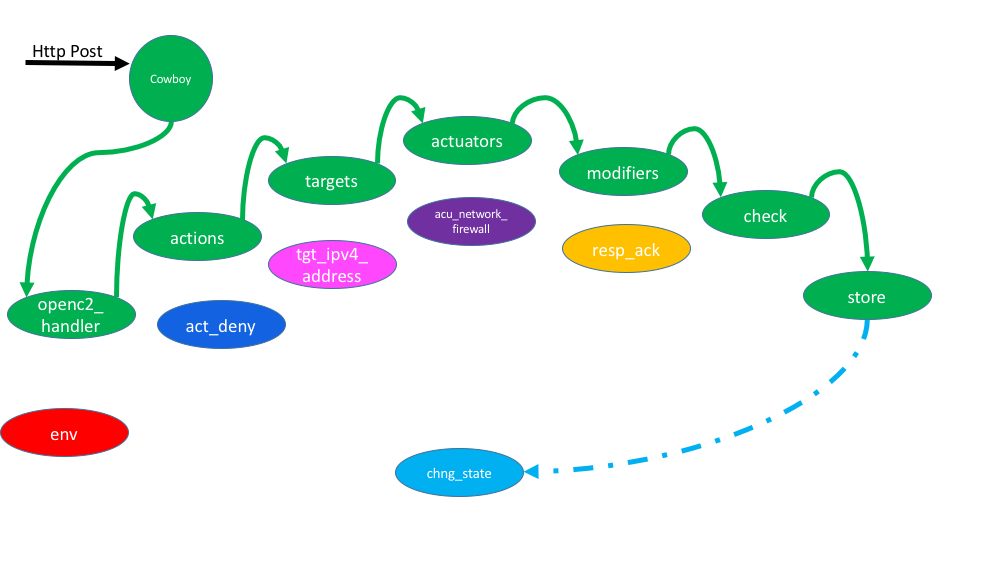

Because


## 1.11 send_resp.erl

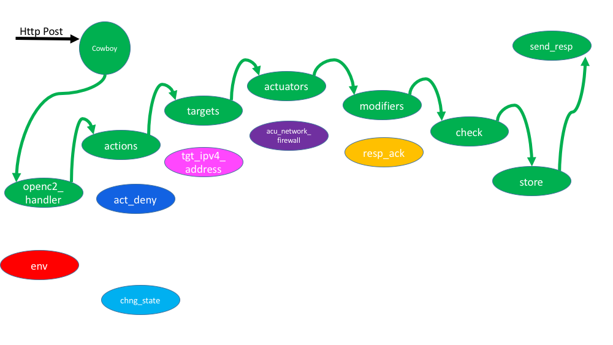

and calls send_response
11. send_response formats the http reply - which at this poit is just putting some State info in json


above is all independent of cybox part at this point (ie cybox stuff is yet to be coded)

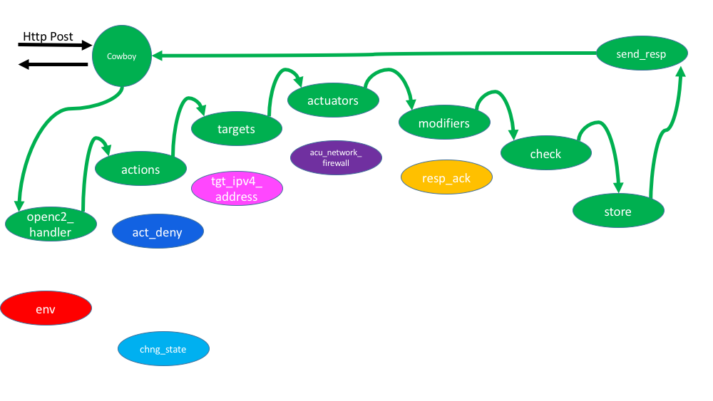

## 1.12 end state


# 2. Sunny Day Firewall Example
In this example, the simulator was previously started and configured with the profile of a particular firewall 
in a given state.
In this particular example, the state is configured with "deny all" (ie no ports or addresses are open in either direction).

## 2.1 Starting Simulator
This instantiated servers for the firewall actuator, env, and the ipv4 target.

how is this done? sys config file? openc2 command? api call to simulator instead of to openc2 (start api?)

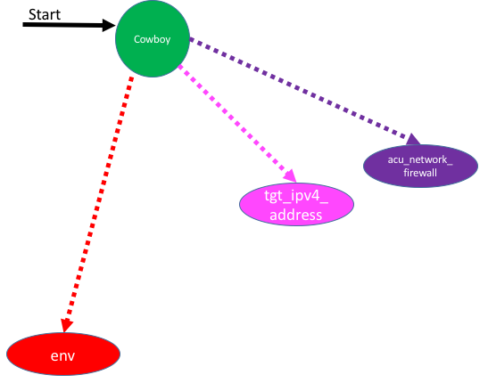

## 2.2 Cowboy


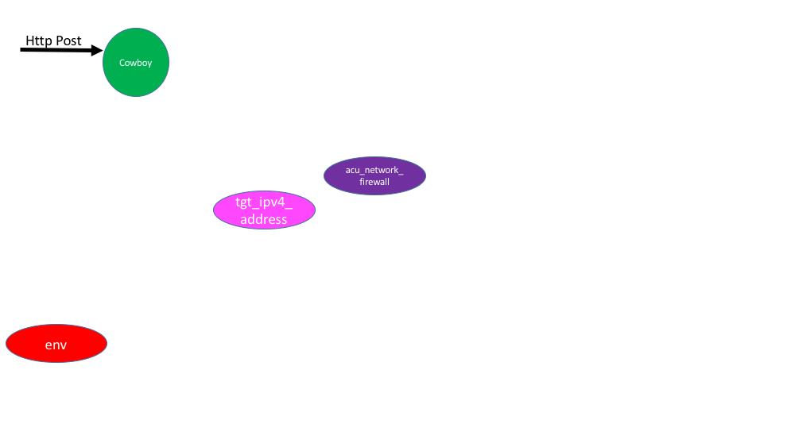

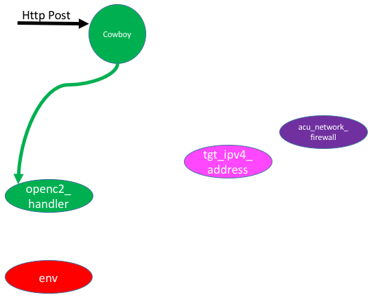

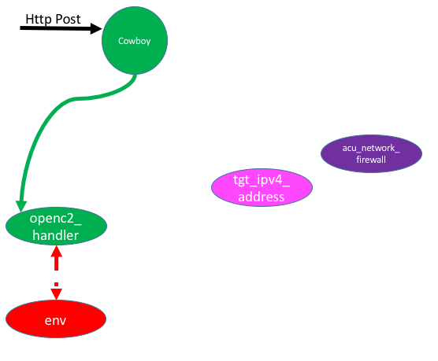

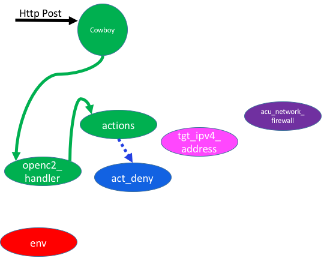


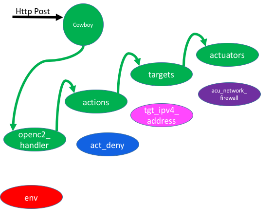

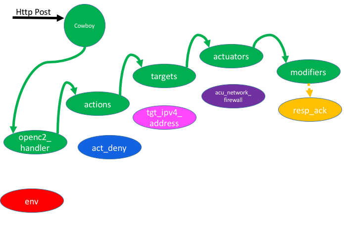

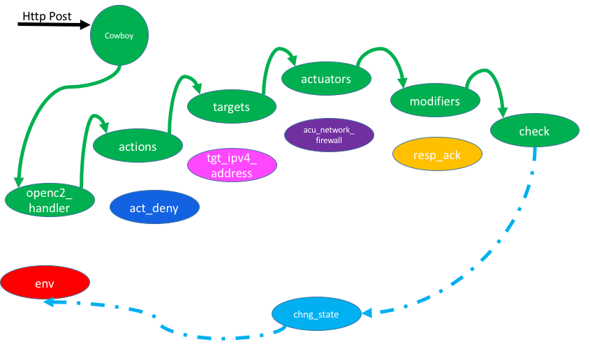

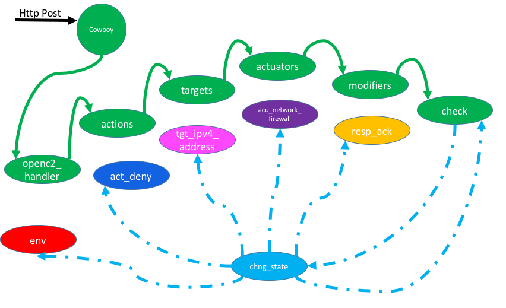


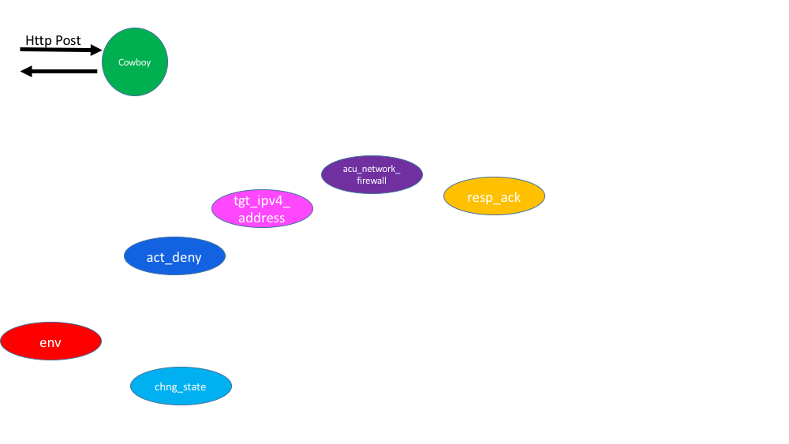

